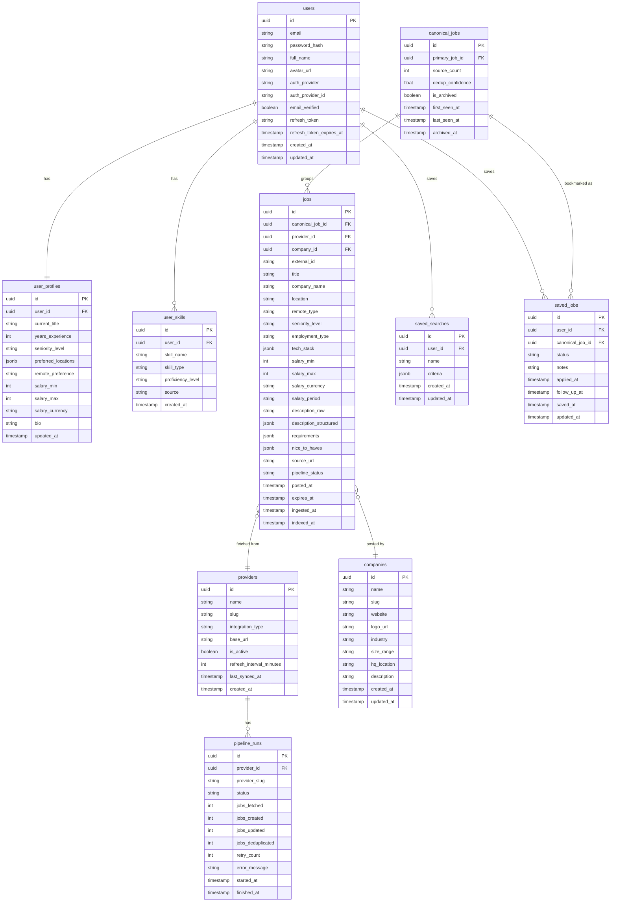

# Jobbly — Technical Design

Companion to [`PRD.md`](./PRD.md). This document answers **how** we build Jobbly: tech stack, architecture, data pipeline, delivery phases, database schema, and API contract.

| Field | Value |
|---|---|
| **Version** | 1.1 |
| **Last Updated** | August 2026 |
| **Backend** | .NET 10 / ASP.NET Core |

> ### Changelog
> | Version | Change |
> |---|---|
> | 1.1 | Finalized project structure as 4-project Clean Architecture (`Domain`/`Application`/`Infrastructure`/`Api`). Removed the separate `Jobbly.Pipeline` project — ingestion pipeline is now Application use cases + ports, implemented by Infrastructure adapters, same as every other feature. Added explicit layer dependency rules (project-reference direction vs. runtime request flow). Renamed `IProviderConnector` → `IJobConnector` for consistency. |
> | 1.0 | Initial technical design |

---

## Table of Contents

| # | Section |
|---|---|
| 1 | [Tech Stack](#1-tech-stack) |
| 2 | [System Architecture](#2-system-architecture) |
| 3 | [Data Pipeline](#3-data-pipeline) |
| 4 | [Delivery Phases](#4-delivery-phases) |
| 5 | [Database Schema & ERD](#5-database-schema--erd) |
| 6 | [API Contract](#6-api-contract) |
| 7 | [Non-Functional Requirements](#7-non-functional-requirements) |

---

## 1. Tech Stack

### 1.1 Frontend

| Layer | Technology | Why |
|---|---|---|
| Framework | Next.js 15 + TypeScript | SSR for SEO on job listings, fast client navigation |
| UI Components | Tailwind CSS + shadcn/ui | Accessible, unstyled primitives |
| Server State | TanStack Query | Caching, background refetch, optimistic updates |
| API Client | Auto-generated via NSwag | Type-safe client from .NET OpenAPI spec |

### 1.2 Backend

| Layer | Technology | Why |
|---|---|---|
| API | ASP.NET Core 10 — Minimal APIs | High throughput, clean endpoint structure |
| Auth | ASP.NET Core Identity + JWT | Battle-tested; Google OAuth via OpenIdConnect |
| ORM | Entity Framework Core 10 + Npgsql | Typed queries, migrations, strong Postgres support |
| Background Jobs | Hangfire on Postgres | Pipeline scheduling, retries, dashboard — no extra infra |
| HTTP Clients | Refit + Polly | Typed provider clients with retry and circuit-breaker |
| CQRS | MediatR | Clean separation of commands, queries, events |
| Validation | FluentValidation | Declarative, testable request validation |
| Mapping | Mapster | Fast, low-ceremony object mapping |
| API Docs | Swashbuckle + NSwag | OpenAPI spec generation + TypeScript client codegen |
| Testing | xUnit + Testcontainers | Integration tests against real Postgres instances |

### 1.3 Infrastructure

| Layer | Technology | Why |
|---|---|---|
| Database | PostgreSQL 16 | Primary store; `jsonb` for flexible fields; `tsvector` full-text for v1 search; pgvector-ready for v2 AI |
| Search | Postgres full-text (`tsvector`/`tsquery`) — **v1** | No extra infra for a side project; Elasticsearch migration planned when scale demands |
| Cache | Redis (StackExchange.Redis) | Session cache, rate limiting, query result cache |
| File Storage | Cloudflare R2 | Resume uploads (v2); S3-compatible, no egress fees |
| Email | Resend | Transactional email (v2 alerts) |
| Containers | Docker + Docker Compose | Local dev — Postgres, Redis, workers in one command |
| Deployment | Railway / Azure App Service | Simple PaaS; Azure preferred for .NET fit |
| Observability | Sentry + Serilog + Seq | Error tracking, structured logs, searchable log UI |

### 1.4 Project Structure

Clean Architecture, four projects. The ingestion pipeline is **not** a separate project — it's Application use cases (orchestration, ports) plus Infrastructure adapters (connectors, EF Core, Hangfire), same as every other feature. This keeps one dependency rule for the whole codebase instead of a special case for the pipeline.

```
Jobbly.sln
├── src/
│   ├── Jobbly.Domain/                     # Entities, value objects, enums — zero dependencies
│   │   ├── Entities/                      # Job, JobSource, PipelineRun, User, SavedSearch, SavedJob
│   │   └── Enums/                         # SeniorityLevel, ApplicationStatus
│   │
│   ├── Jobbly.Application/                # Use cases, CQRS handlers (MediatR), ports (interfaces)
│   │   ├── Pipeline/
│   │   │   ├── IJobConnector.cs           # port — no implementation here
│   │   │   ├── IJobNormalizer.cs
│   │   │   ├── IDeduplicationService.cs
│   │   │   ├── IEnrichmentService.cs
│   │   │   └── RunIngestionPipeline.cs    # orchestrator; depends only on interfaces above
│   │   ├── Jobs/                          # Search, save, tracker use cases
│   │   ├── Users/                         # Profile, auth-adjacent use cases
│   │   └── Interfaces/
│   │       └── IJobblyDbContext.cs        # Application defines what it needs from Infrastructure
│   │
│   ├── Jobbly.Infrastructure/             # Implements Application's interfaces
│   │   ├── Connectors/                    # One connector class per provider
│   │   │   ├── GreenhouseConnector.cs     # implements IJobConnector
│   │   │   └── LeverConnector.cs
│   │   ├── Persistence/
│   │   │   └── JobblyDbContext.cs         # implements IJobblyDbContext — EF Core + Npgsql
│   │   ├── BackgroundJobs/
│   │   │   └── HangfireIngestionScheduler.cs
│   │   ├── Caching/                       # Redis
│   │   └── Storage/                       # R2 (v2 — resume uploads)
│   │
│   └── Jobbly.Api/                        # Minimal API endpoints, composition root
│       ├── Endpoints/                     # Jobs, Users, Search, Auth
│       ├── Middleware/                    # Auth, rate limiting, error handling
│       └── Program.cs                     # DI wiring — the only place concrete types meet interfaces
│
├── web/                                   # Next.js frontend (npm workspace)
├── tests/
│   ├── Jobbly.Application.Tests/          # Mocks IJobConnector etc. — no DB/HTTP needed
│   └── Jobbly.Infrastructure.Tests/       # Connector parsing, EF Core mapping
├── docker-compose.yml
└── README.md
```

#### Layer dependency rules

Two different things point in two different directions here, and conflating them is the most common Clean Architecture mistake — worth stating explicitly:

**Project references (compile-time — what each `.csproj` is allowed to reference):**

```
Jobbly.Domain          ← referenced by nothing; plain C#, zero dependencies
      ▲
Jobbly.Application     ← references Domain only
      ▲
Jobbly.Infrastructure  ← references Application + Domain (implements Application's interfaces)
      ▲
Jobbly.Api             ← references all three (composition root)
```

**Request flow (runtime — what actually calls what when a request comes in):**

```
HTTP Request → Api → Application → Domain
                        ↕
                 Infrastructure (invoked via interface, e.g. IJobConnector, IJobblyDbContext)
```

**The one non-negotiable rule:** `Jobbly.Application` never references `Jobbly.Infrastructure`. It only knows about interfaces it defines itself. `Infrastructure` reaches inward to implement those interfaces — that's the Dependency Inversion the layers exist to enforce.

`Jobbly.Api` referencing `Jobbly.Infrastructure` is expected and necessary — but only for DI registration in `Program.cs` (mapping `IJobblyDbContext` → `JobblyDbContext`, `IJobConnector` → `GreenhouseConnector`, etc.). No endpoint handler in `Jobbly.Api` should reference a concrete Infrastructure type directly; they depend on Application's interfaces and use cases only.

---

## 2. System Architecture

```
┌─────────────────────────────────────────────────────┐
│                   JOBBLY WEB APP                    │
│         Next.js 15 — SSR + Client Components        │
│       TS client auto-generated by NSwag / OpenAPI   │
└────────────────────┬────────────────────────────────┘
                     │  HTTPS / REST
┌────────────────────▼────────────────────────────────┐
│            ASP.NET Core 10 — Minimal APIs           │
│          JWT Auth · Rate Limiting · OpenAPI         │
└────────────┬────────────────────┬───────────────────┘
             │                    │
┌────────────▼──────┐  ┌──────────▼─────────────────┐
│   User Service    │  │        Job Service          │
│  Identity · JWT   │  │  Search · Filter · Rank     │
└───────────────────┘  └──────────┬──────────────────┘
                                  │
┌─────────────────────────────────▼──────────────────┐
│             Hangfire — Background Jobs              │
│        Pipeline Workers · Scheduling · Retries     │
└─────────────────────────────────┬──────────────────┘
                                  │
┌─────────────────────────────────▼──────────────────┐
│                   DATA PIPELINE                     │
│    Ingest ▶ Normalize ▶ Dedup ▶ Enrich ▶ Index     │
└──────┬──────────┬──────────┬──────────┬────────────┘
       │          │          │          │
  ┌────▼───┐ ┌───▼────┐ ┌───▼────┐ ┌──▼──────┐
  │Provider│ │Provider│ │Provider│ │ +more   │
  └────────┘ └────────┘ └────────┘ └─────────┘

  Infrastructure
  ──────────────
  PostgreSQL 16     primary store + full-text search + Hangfire storage
  Redis             cache + sessions
  Cloudflare R2     file storage (resumes · v2)
```

---

## 3. Data Pipeline

### 3.1 Overview

The pipeline is the backbone of Jobbly. It runs continuously as .NET `BackgroundService` workers orchestrated by Hangfire. Each provider is isolated behind a shared interface — a broken connector never takes down others.

### 3.2 Provider Contract

```csharp
public interface IJobConnector
{
    string ProviderSlug { get; }
    Task<IReadOnlyList<RawJobDto>> FetchAsync(CancellationToken ct);
}
```

This interface is a **port** — it lives in `Jobbly.Application/Pipeline/` (see §1.4). Every provider connector (`GreenhouseConnector`, `LeverConnector`, ...) is an **adapter** implementing it from `Jobbly.Infrastructure/Connectors/`. `RunIngestionPipeline` (also in Application) depends only on `IJobConnector`, never on a concrete connector — that's what lets a broken provider stay isolated and lets a new provider be added as pure Infrastructure work with zero changes to the orchestrator. Polly wraps each call with a retry policy and a circuit breaker.

### 3.3 Providers — Roll-out Plan

> **v1 ships with 1–3 providers.** The architecture supports any number; we prove the pipeline with one connector first, then generalize. Greenhouse is the first connector (see PRD §9, Decision 6); Lever follows second.

| Provider | Method | Frequency | Status |
|---|---|---|---|
| Greenhouse | Public API | Every 3 h | **First (v1)** |
| Lever | Public API | Every 3 h | **Second (v1)** |
| Workable | Public API | Every 3 h | Later |
| Indeed | RSS + HTTP | Every 4 h | Later |
| LinkedIn Jobs | Official API | Every 2 h | Later |
| Wellfound (AngelList) | API | Every 4 h | Later |
| Remote.co | RSS | Every 6 h | Later |
| We Work Remotely | RSS | Every 6 h | Later |
| Stack Overflow Jobs | Feed | Every 6 h | Later |
| Company Career Pages | HTTP scraper | Every 12 h | Later |

> **Why Greenhouse + Lever first:** both are ATS platforms (applicant tracking systems) with very similar REST JSON APIs — the same job, location, and compensation shapes. Building the Greenhouse connector proves the whole adapter pattern; the Lever connector reuses most of it.

### 3.4 Pipeline Stages

```
Stage 1 — INGEST
  Hangfire triggers each IJobConnector on schedule.
  Raw payload saved to pipeline_runs for observability.
  Polly retries on failure (exponential backoff, max 5 attempts).

Stage 2 — NORMALIZE
  Provider-specific INormalizer maps raw payload → canonical Job entity.
  Ensures consistent schema regardless of source format.

Stage 3 — DEDUPLICATE
  Fingerprint: hash(title + company + location + date).
  Compared against existing canonical_jobs.
  Duplicate → linked to canonical. New → creates canonical record.

Stage 4 — ENRICH  (rule-based in v1 · AI in v2)
  v1: Keyword matching for tech stack · regex for seniority inference
  v1: Salary normalization (currency, period)
  v2: AI enrichment for accuracy and structured requirements

Stage 5 — INDEX
  Enriched job upserted into the Postgres search index.
```

### 3.5 Data Freshness SLA

| Tier | Target |
|---|---|
| Hot listings (< 24 h old) | Indexed within 2 h |
| Standard listings | Indexed within 12 h |
| Stale listings (> 30 d) | Auto-archived (soft delete) |

---

## 4. Delivery Phases

### Guiding Principle

> v1 should validate Jobbly's core value: can we reliably aggregate technical jobs, deduplicate them, and give users a better search and tracking experience than existing job boards?

The pipeline and searchable job catalog come before advanced user features.

### Phase 0 — Foundation and Architecture

**Goal:** Establish the backend structure, conventions, and infrastructure.

**Scope**
- Confirm project boundaries: `Domain` (entities, no dependencies), `Application` (use cases, ports/interfaces), `Infrastructure` (EF Core, connectors, Hangfire — implements Application's interfaces), `Api` (Minimal API endpoints, composition root) — see §1.4 for the full structure and dependency rules
- Set up PostgreSQL + EF Core with initial migration workflow
- Define base entities for v1
- Configuration structure for: database, provider settings, pipeline schedules, auth settings
- Set up Postgres full-text search (`tsvector` + `tsquery`) as the v1 search approach
- Logging and error-handling baseline

**Exit Criteria**
- Backend starts successfully with database connectivity
- Core entities and interfaces defined for pipeline and jobs domain
- Vertical slices can be added without restructuring the solution

### Phase 1 — Pipeline Backbone

**Goal:** Build the engine that fetches, normalizes, deduplicates, and stores jobs.

**Scope**
- Create v1 ingestion tables: `providers`, `companies`, `jobs`, `canonical_jobs`, `pipeline_runs`
- Define pipeline stages: fetch → normalize → deduplicate → enrich → persist → index
- Build **one provider connector** end-to-end first — **Greenhouse** (see PRD §9, Decision 6)
- Persist raw payloads / diagnostics for debugging failures
- First-pass dedup logic
- Rule-based enrichment: tech stack tags, seniority inference, salary normalization
- Hangfire orchestration for scheduled runs; run metrics in `pipeline_runs`

**Exit Criteria**
- A provider run fetches, processes, and persists jobs successfully
- Duplicate jobs link to one canonical listing
- Failed runs are debuggable

> **Note:** do not start with 10 providers. Prove the architecture with one, then generalize.

### Phase 2 — Search and Job Discovery MVP

**Goal:** Expose the first user-facing value — discoverable, searchable jobs.

**Scope**
- `GET /api/jobs`, `GET /api/jobs/{id}`, `GET /api/companies/{id}`
- Postgres full-text search with v1 filters: keyword, role type, tech stack, seniority, location, remote, salary
- Sort: relevance, date posted, salary
- Job cards + listing detail with dedup attribution

**Exit Criteria**
- A user searches and filters jobs from at least one live provider
- Results are clean enough to demonstrate core value
- Public browsing works without authentication

> This is the earliest phase that can be meaningfully demoed. If search quality is weak here, do not rush into auth and dashboards.

### Phase 3 — Accounts and Profile

**Goal:** Add user identity and persistent preferences without blocking public browsing.

**Scope**
- Tables: `users`, `user_profiles`, `user_skills`
- Auth: register, login, refresh token, optional Google OAuth
- Profile endpoints and fields (title, seniority, experience, stack, locations, remote pref, salary expectation)
- Keep job search public

**Exit Criteria**
- Users create accounts and maintain profiles
- Authenticated endpoints are secure and stable
- Public search still works without a registration wall

### Phase 4 — Saved Jobs, Saved Searches, and Application Tracker

**Goal:** Deliver the second major v1 value after search: simple job tracking, plus persisted searches powering the dashboard feed.

**Scope**
- `saved_jobs` table + endpoints; states `saved`/`applied`/`in_progress`/`closed`
- Notes + follow-up date (display only)
- `saved_searches` table + endpoints
- Dashboard feed (`/dashboard/feed`) and saved-search management (`/dashboard/saved-searches`)
- Saved jobs anchor to canonical jobs, not raw provider rows

**Exit Criteria**
- Save a job, mark applied, update status, store notes
- Tracker works against deduplicated records
- Save search criteria and see matching jobs in the dashboard feed

### Phase 5 — Expand Coverage and Harden v1

**Goal:** Turn the first working slice into a stable launchable v1.

**Scope**
- Add more provider connectors incrementally
- Improve dedup accuracy and enrichment rules with real data feedback
- Caching, rate limiting, production error handling
- Observability hardening: structured logs, pipeline failure alerts, dashboard protection
- Integration/e2e tests: pipeline runs, search, auth, saved jobs, saved searches
- Validate performance against v1 targets

**Exit Criteria**
- Multiple providers run independently without cascading failures
- Search and tracking flows are stable enough for real users
- v1 scope complete without slipping into v2 features

### Recommended Milestone Order

1. Phase 0 → 1 → 2 → 3 → 4 → 5

### Recommended First Execution Slice

1. Set up database and v1 job tables
2. Add one provider connector — Greenhouse
3. Run one scheduled pipeline flow end-to-end
4. Persist canonical jobs
5. Expose `GET /api/jobs` and `GET /api/jobs/{id}`

This creates a working backbone before investing in auth or dashboards.

---

## 5. Database Schema & ERD

### 5.1 v1 ERD — Core Tables Only

> 10 tables. Covers job aggregation, user accounts, bookmarking, saved searches, application tracking, and pipeline observability. Future v2/v3 tables (`resumes`, `alerts`, `alert_matches`, `notifications`, `job_match_scores`, `skill_gaps`, `learning_resources`) are planned but **not created in v1** — schema design for them happens when the corresponding feature is scheduled.



### 5.2 Schema Notes

- The schema models both raw provider jobs (`jobs`) and deduplicated aggregate jobs (`canonical_jobs`).
- Saved jobs and saved searches anchor to `canonical_jobs`, not provider-specific `jobs`.
- `preferred_locations`, `tech_stack`, `requirements`, and `nice_to_haves` are `jsonb` — they represent arrays in the canonical schema.
- `users` carries `refresh_token` / `refresh_token_expires_at` for JWT refresh auth (7-day httpOnly cookie). Tokens stored hashed at rest.
- `canonical_jobs` includes `is_archived`/`archived_at` for the 30-day stale-listing auto-archive SLA; archived jobs are soft-deleted and excluded from the main feed.
- `providers` includes `last_error` and `consecutive_failures` for provider health (Polly circuit-breaker support).
- `pipeline_runs` includes `provider_slug` (denormalized) and `retry_count` to track Hangfire retry attempts.
- Search: Postgres `tsvector` column + GIN index on the searchable fields, plus `pg_trgm` for fuzzy matching where needed.

---

## 6. API Contract

### 6.1 API Style

- Protocol: `HTTPS`
- Payload: `JSON`
- Standard: `OpenAPI / Swagger`
- Auth: JWT access token (15 min) + refresh token (7 days) in httpOnly cookie
- **Search endpoints are public** — no auth required to browse

### 6.2 Endpoints by Feature

#### Job Search & Discovery

`GET /api/jobs`

Returns a paginated list of job listings matching the search criteria.

Query parameters:

- `page`, `pageSize`
- `q=dotnet backend`
- `roleType=backend`
- `tags=dotnet,postgres`
- `seniority=senior`
- `location=cairo`
- `remote=true`
- `salaryMin=60`, `salaryMax=120`, `salaryCurrency=usd`
- `sort=relevance` | `date` | `salary`

`GET /api/jobs/{id}` — complete details for a single listing.

`GET /api/companies/{id}` — company metadata for the "About Company" section.

#### Auth

| Method | Endpoint | Description |
|---|---|---|
| `POST` | `/api/auth/register` | Register with email + password |
| `POST` | `/api/auth/login` | Login, returns session tokens |
| `POST` | `/api/auth/refresh` | Rotate refresh token |
| `GET` | `/api/auth/google` | Google OAuth flow |

#### User Profile

| Method | Endpoint | Description |
|---|---|---|
| `GET` | `/api/users/me` | Current user profile |
| `PUT` | `/api/users/me/profile` | Update profile fields |
| `PUT` | `/api/users/me/skills` | Replace tech stack / skills |

#### Saved Searches

| Method | Endpoint | Description |
|---|---|---|
| `GET` | `/api/saved-searches` | List saved searches |
| `POST` | `/api/saved-searches` | Create a saved search |
| `PATCH` | `/api/saved-searches/{id}` | Update name or criteria |
| `DELETE` | `/api/saved-searches/{id}` | Delete a saved search |

#### Saved Jobs & Application Tracker

| Method | Endpoint | Description |
|---|---|---|
| `GET` | `/api/saved-jobs` | List saved / tracked jobs |
| `POST` | `/api/saved-jobs` | Save a job |
| `PATCH` | `/api/saved-jobs/{id}` | Update status, notes, follow-up |
| `DELETE` | `/api/saved-jobs/{id}` | Unsave / remove |

### 6.3 Request and Response Models

#### Job Listing

| Field | Type | Notes |
| --- | --- | --- |
| `id` | string | Internal unique identifier (canonical job) |
| `title` | string | Job title |
| `company` | string | Company display name |
| `location` | string | Human-readable location |
| `remoteType` | string | `remote` / `hybrid` / `on-site` |
| `salaryMin` | number | Normalized minimum salary |
| `salaryMax` | number | Normalized maximum salary |
| `salaryCurrency` | string | ISO currency code |
| `salaryPeriod` | string | `year` / `month` / `hour` |
| `techStack` | string[] | Normalized technology tags |
| `seniority` | string | `junior` / `mid` / `senior` / `staff` / `principal` |
| `postedAtUtc` | datetime | Normalized publish date |
| `sourceCount` | int | Number of boards this job was found on |

#### Job Listing Detail

Extends the listing model with:

| Field | Type | Notes |
| --- | --- | --- |
| `overview` | string | Structured description summary |
| `requirements` | string[] | Must-have requirements |
| `niceToHaves` | string[] | Nice-to-have requirements |
| `sourceUrl` | string | Original listing URL on the provider |
| `companyInfo` | object | Company metadata |

#### Saved Search

| Field | Type | Notes |
| --- | --- | --- |
| `id` | string | Saved search identifier |
| `name` | string | User-provided name |
| `criteria` | object | Same filter object as `GET /api/jobs` query params |

#### Saved Job / Application

| Field | Type | Notes |
| --- | --- | --- |
| `id` | string | Saved job identifier |
| `canonicalJobId` | string | Referenced canonical job |
| `status` | string | `saved` / `applied` / `in_progress` / `closed` |
| `notes` | string | Private free-text note |
| `followUpAt` | datetime | Follow-up reminder date (display only in v1) |
| `appliedAt` | datetime | When marked applied |
| `updatedAt` | datetime | Last status change |

### 6.4 Filtering, Sorting & Pagination Rules

- Filters: keyword, role type, tech stack, seniority, location, remote, salary range.
- Filters are combinable and non-destructive.
- Sort options: `relevance` (default), `date`, `salary`.
- Pagination is deterministic — stable ordering across pages.

### 6.5 Error Handling

| Status Code | Meaning |
| --- | --- |
| `400` | Invalid request or malformed filters |
| `401` | Unauthenticated — missing or expired token |
| `403` | Forbidden — insufficient permissions |
| `404` | Resource not found |
| `409` | Conflict — e.g., duplicate save |
| `429` | Too many requests |
| `500` | Unexpected server error |

### 6.6 Tooling Notes

- Swagger/OpenAPI is the source of truth for implemented endpoints.
- The frontend TypeScript client is auto-generated from the OpenAPI spec via NSwag — no manual DTOs.
- This section must stay aligned with the generated API metadata and the models in §5 as the backend grows.

---

## 7. Non-Functional Requirements

### 7.1 Performance

| Metric | Target |
|---|---|
| Time to First Contentful Paint | < 1.5 s |
| Search response time (P95) | < 500 ms |
| Perceived search latency (cached common queries) | < 300 ms |
| Pipeline ingestion lag — hot listings | < 2 h |

### 7.2 Scalability

| Concern | Approach |
|---|---|
| Search index size | Postgres full-text (v1); Elasticsearch migration when it becomes a bottleneck |
| Pipeline throughput | Hangfire workers scale horizontally |
| API scaling | Stateless API — horizontal scaling behind a load balancer |

### 7.3 Reliability

| Component | Target |
|---|---|
| Core search API | 99.9 % uptime SLA |
| Pipeline provider failure | Isolated via Polly circuit breaker — one broken provider doesn't cascade |
| Job retry policy | Up to 5 retries with exponential backoff via Hangfire |

### 7.4 Security & Privacy

| Concern | Implementation |
|---|---|
| Data in transit | TLS 1.3 enforced |
| Data at rest | Encrypted at the storage layer |
| Password storage | PBKDF2 + salt via ASP.NET Core Identity |
| Session tokens | JWT (15 min) + refresh token in httpOnly cookie (7 days) |
| User rights | GDPR — right to access + right to delete (soft delete + purge job) |
| Data sharing | No user data sold or shared with employers or third parties |

### 7.5 Accessibility

- WCAG 2.1 AA for all core flows
- Full keyboard navigation
- Screen reader-compatible job cards, search, and filters

---

*Owner: Engineering Team*
*Backend: .NET 10 / ASP.NET Core*
